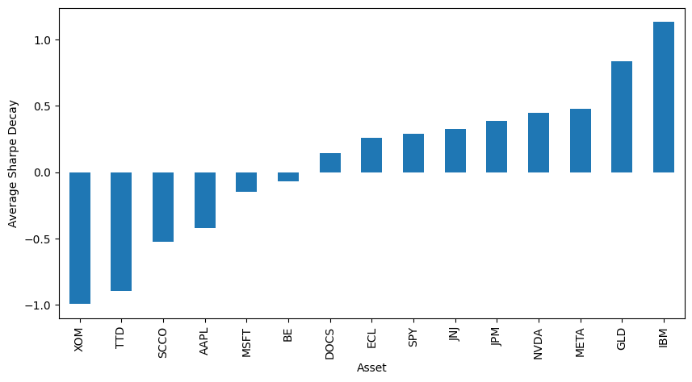
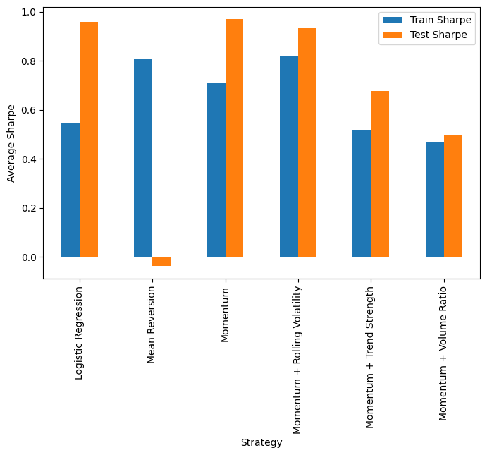
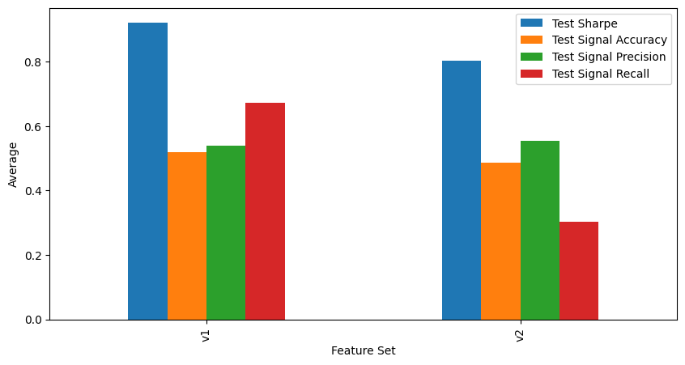
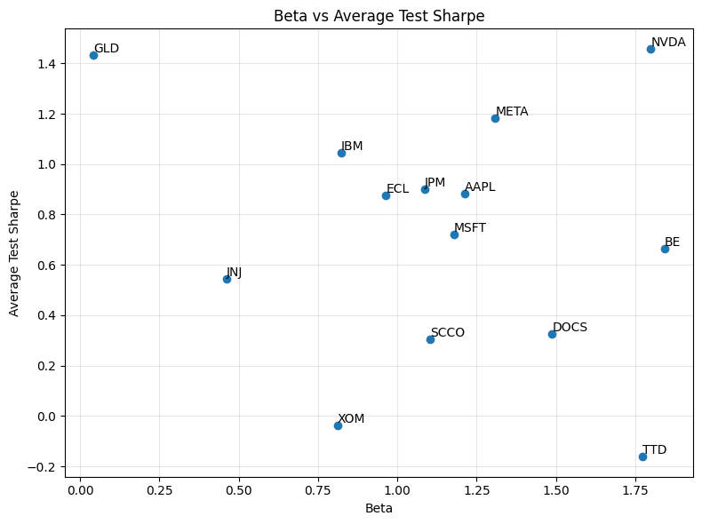
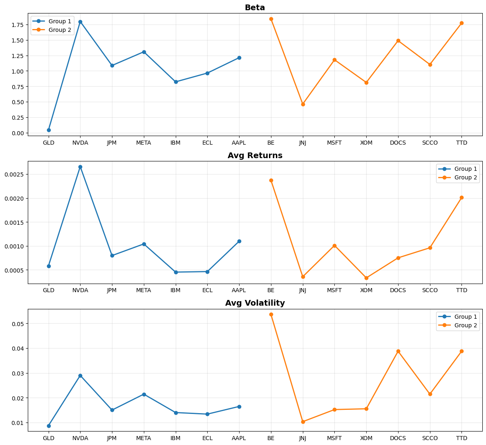
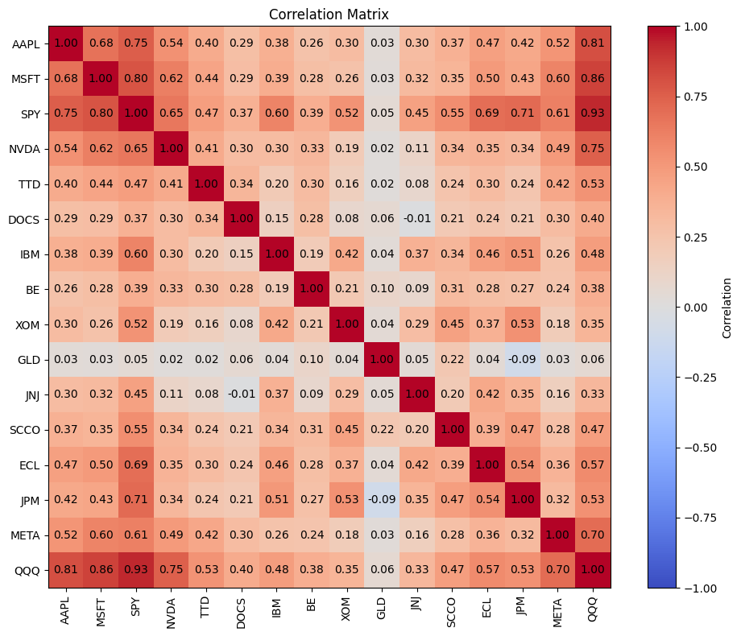

# Quantitative Research Project

## Overview
This project is an independent quantitative research project focused on building and testing different systematic trading strategies across a variety of assets. The project explores whether or not we can build robust trading signals using rule-based and machine learning-based algorithms. The project started with the exploration of momentum and mean reversion strategies and expanded into a research project that, among other topics of interest, included feature engineering and portfolio construction. Strategy performance was evaluated using Sharpe ratio, volatility, maximum drawdown, and generalization from training to testing data sets. Key findings suggest that momentum strategies provided stronger robustness in the testing set, while mean reversion showed signs of overfitting. Machine learning models can be said to be competitive strategies; however they didn't consistently outperform some of the simpler rule-based strategies such as the momentum strategy. Portfolio diversification reduced volatility and drawdowns, while an asset's beta value didn't show a significant relationship with the testing performance.

## Research Questions
- Do Momentum and Mean Reversion strategies generalize?
- Can Machine Learning improve trading signals?
- How does performance change across market regimes?

## Methodology
Throughout this project we extracted data from a number of assets using a train/test split. We built and tested different strategies, including rule-based and machine learning-based strategies. For the different experiments, we looked into what was working with each experiment and what was causing different failures, whether that was something related to the strategy used or the asset itself. 

## Results
Some important figures generated throughout the project:

Week 6: Avg Sharpe Decay per Asset

Week 6: Avg Train Sharpe vs Avg Test Sharpe per Strategy
 

Week 7: ML Feature Set Avg Metrics

Week 8: Beta vs Avg Test Sharpe

Week 9: Cross-Sectional Analysis

Week 10: Correlation Matrix

## Repository Structure
The folder 'notebooks' contains all Jupyter Notebooks where I experiment with the code, data, strategies, etc.
The folder 'notes' contains Markdown documents starting at week 3 for weekly documentation of results.
The folder 'figures' contains CSV files recording experiment outputs and other important tabular data and another folder 'figures' containing some of the most meaningful figures generated each week.
The folder 'reports' contains the final report of the project, condensing findings and conclusions.
The folder 'src' contains all of the functions created throughout the project.

## Future Work
In the future, this project could potentially look more into different machine learning algorithms and feature selection processes. I'd also like to explore more topics in portfolio construction and experiment with different ways to optimize asset weights and risk-return tradeoffs. For further work, I would split the data into training/validation/testing sets instead of the current training/testing to mitigate some of the overfitting that is seen in some of the rule-based strategies such as mean reversion. Finally, I would expand the asset universe used to be able to find more patterns in my observations of how the different strategies are working. 